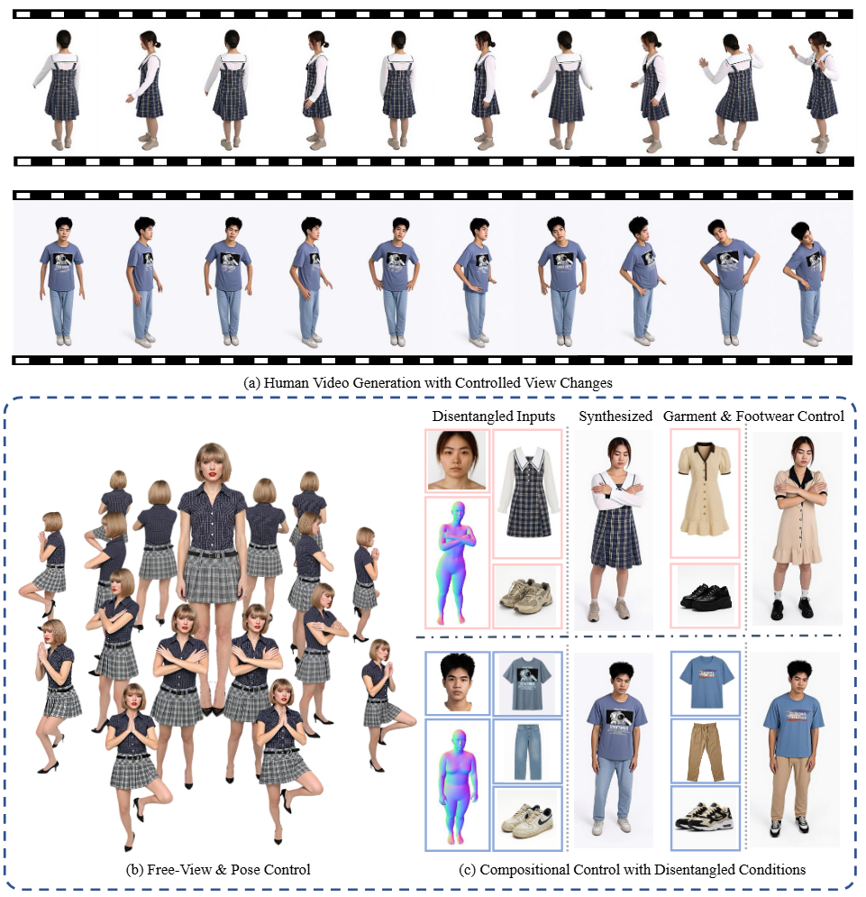

<div align="center">

# ReImagine

**ReImagine: Rethinking Controllable High-Quality Human Video Generation via Image-First Synthesis**

<p>
  <a href="https://arxiv.org/abs/2604.19720"></a>
  <a href="https://keruzheng.github.io/ReImagine-Project/"></a>
  <a href="https://taited-reimagine.hf.space/"></a>
  <a href="https://www.youtube.com/watch?v=M5J1Yfp778o"></a>
</p>

<a href="https://keruzheng.github.io/ReImagine-Project/">
  
</a>

</div>

## Overview

This repository hosts the official implementation of **ReImagine**, a framework for controllable high-quality human video generation via **image-first synthesis**. For more context, see the [paper on arXiv](https://arxiv.org/abs/2604.19720) and the [project website](https://keruzheng.github.io/ReImagine-Project/).

## Quick links

| | |
| --- | --- |
| **arXiv** | [ReImagine (arXiv:2604.19720)](https://arxiv.org/abs/2604.19720) |
| **Project page** | [Qualitative results & details](https://keruzheng.github.io/ReImagine-Project/) |
| **Interactive demo** | [Hugging Face Space](https://taited-reimagine.hf.space/) |
| **Dataset** | *Placeholder — add the public dataset or download page URL when available.* |

*The dataset row above is a TBA placeholder; replace the italic text with a markdown link (e.g. Hugging Face Datasets, Zenodo, or your project page) at release time.*

## Demo video

<p align="center">
  <a href="https://www.youtube.com/watch?v=M5J1Yfp778o&autoplay=1" title="Play demo on YouTube">
    
  </a>
</p>

<p align="center">
  <strong><a href="https://www.youtube.com/watch?v=M5J1Yfp778o&autoplay=1">Watch the demo on YouTube</a></strong> (autoplay on open)
</p>

## Try it online

**[Launch the Hugging Face Space →](https://taited-reimagine.hf.space/)**

## Release plan

The code, pretrained weights, and dataset resources will be fully uploaded and open-sourced before **May 1, 2026**.

## Status

- [ ] Code release
- [ ] Pretrained model weights
- [ ] Dataset release
- [ ] Documentation and usage instructions

We are still organizing the repository; updates will land here as each item is ready.

## Citation

If you find this project useful, please consider citing our paper:

```bibtex
@article{sun2025rethinking,
  title={ReImagine: Rethinking Controllable High-Quality Human Video Generation via Image-First Synthesis},
  author={Sun, Zhengwentai and Zheng, Keru and Li, Chenghong and Liao, Hongjie and Yang, Xihe and Li, Heyuan and Zhi, Yihao and Ning, Shuliang and Cui, Shuguang and Han, Xiaoguang},
  journal={arXiv preprint arXiv:2604.19720},
  year={2026},
  url={https://arxiv.org/abs/2604.19720v1}
}
```
